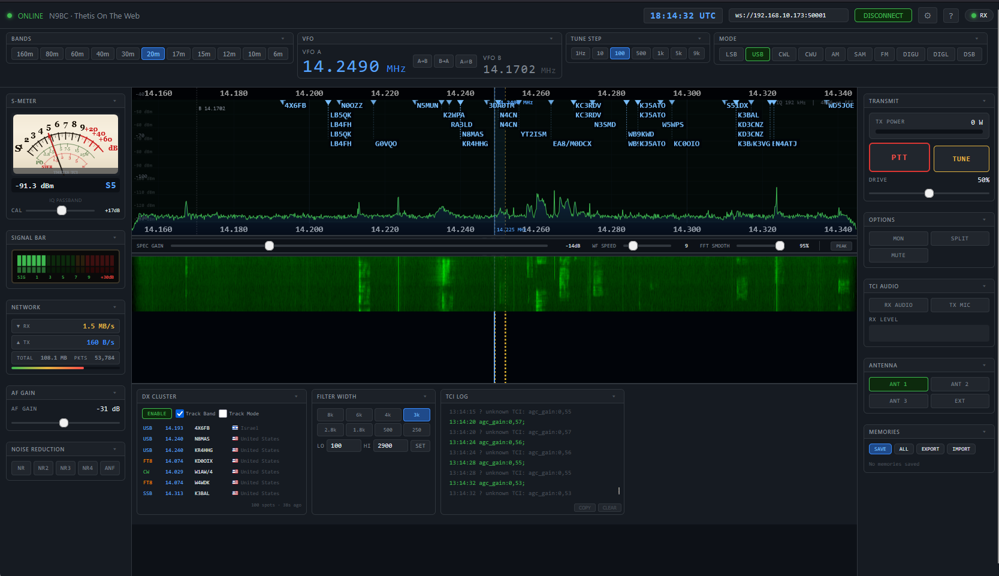

# Thetis On The Web (TOTW)

Thetis On The Web is a lightweight, zero-install, browser-based client for the Thetis SDR software. It communicates with Thetis via WebSockets using the TCI (Transceiver Control Interface) Protocol v2.0, providing full rig control, real-time IQ panadapter displays, and two-way audio streaming directly in your web browser.

Built entirely with vanilla HTML, CSS, and JavaScript, it requires no build tools or external dependencies.

## ✨ Features

* **Real-Time Panadapter & Waterfall:** Hardware-accelerated Canvas rendering with client-side FFT processing for smooth, high-resolution IQ spectrum displays.
* **Full Rig Control:** * VFO A / VFO B control with Split and Swap functions.
    * Mode selection (USB, LSB, CW, AM, DIGI, etc.).
    * Adjustable tune steps, filter widths, and AF/Drive gain.
    * Noise Reduction (NR1-4) and Auto Notch Filter (ANF) toggles.
* **Two-Way TCI Audio:** Listen to RX audio and transmit using your local microphone directly through the browser.
* **DX Cluster Integration:** Built-in Spothole API integration overlays DX spots directly onto the panadapter, with filtering by continent and CQ zone.
* **Memory Management:** Save, recall, import, and export frequency memories as JSON files.
* **Customizable Workspace:** * Draggable, dockable, and collapsible UI panels.
    * Multiple color themes (Classic, Heat, Gray, Night, Amber).
    * Resizable spectrum and waterfall displays.
* **Analog & LED Metering:** High-fidelity, vintage-style analog S-Meter/Power/SWR display and a CB-style LED signal bar.
* **Digital Mode Markers:** Visual markers on the panadapter for common FT8, FT4, WSPR, and JS8 frequencies.

## 🚀 Getting Started

### Prerequisites
1.  **Thetis:** You must have Thetis running and configured to accept TCI connections.
2.  **Modern Web Browser:** Chrome, Edge, or Firefox are recommended for optimal WebAudio and Canvas performance.

### Installation & Usage
Because TOTW is a single-file web application, "installation" is instant:

1.  Open Thetis and ensure the **TCI Server** is enabled (usually found in Setup > TCI). Note the port number (default is usually `50001`).
2.  Open the `totw.html` file in your web browser. 
3.  In the top navigation bar, ensure the WebSocket address matches your Thetis TCI server (e.g., `ws://127.0.0.1:50001` or `ws://<your-radio-ip>:50001`).
4.  Click **CONNECT**.

*Note: For microphone access during TX, modern browsers require the page to be served over `https://` or accessed via `localhost` / `127.0.0.1`.*

### Configuration
Click the gear icon (⚙) in the top bar to open the Settings modal. Here you can configure:
* Your operator details (Callsign, Grid, Name) — *e.g., N9BC / EN54.*
* Auto-connect on startup.
* Spacebar PTT behavior (Momentary hold vs. Toggle).
* UI Theme and panel visibility.
* DX Cluster filtering rules.

## ⌨️ Keyboard Shortcuts

| Shortcut | Action |
| :--- | :--- |
| **Space** | PTT (momentary hold or toggle based on settings) |
| **Up / Down** | VFO step up / down |
| **Ctrl + Up/Down** | Large VFO step (×10) |
| **Mouse Wheel** | Scroll over the spectrum or VFO digits to tune |
| **Ctrl + Scroll** | Zoom in/out on the panadapter |
| **Dbl-Click Spec** | Reset panadapter zoom |
| **M** | Save current frequency to memory |
| **F1 – F4** | Recall memories 1 through 4 |
| **D** | Toggle digital mode markers |
| **X** | Toggle DX cluster overlay |
| **P** | Toggle peak hold on the spectrum |
| **?** | Show keyboard shortcut help |
| **Esc** | Close active modals |

## 🛠️ Technical Details
* **TCI Protocol:** Utilizes TCI v2.0 for all telemetry, control, and binary audio/IQ streams.
* **Audio Pipeline:** Uses the Web Audio API (`AudioContext`). Float32 interleaved stereo streams are decoded directly from the WebSocket binary frames.
* **IQ Processing:** Raw I/Q data is processed in the browser using a custom Radix-2 Cooley-Tukey FFT implementation with a Blackman-Harris window.

## 📝 License
**MIT**
